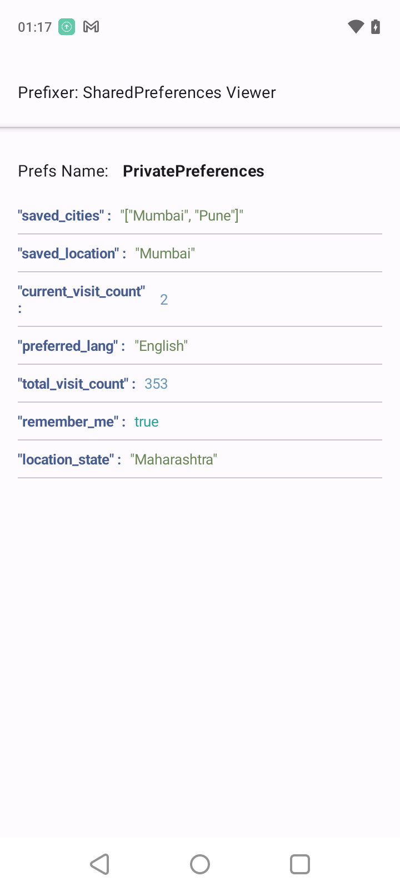
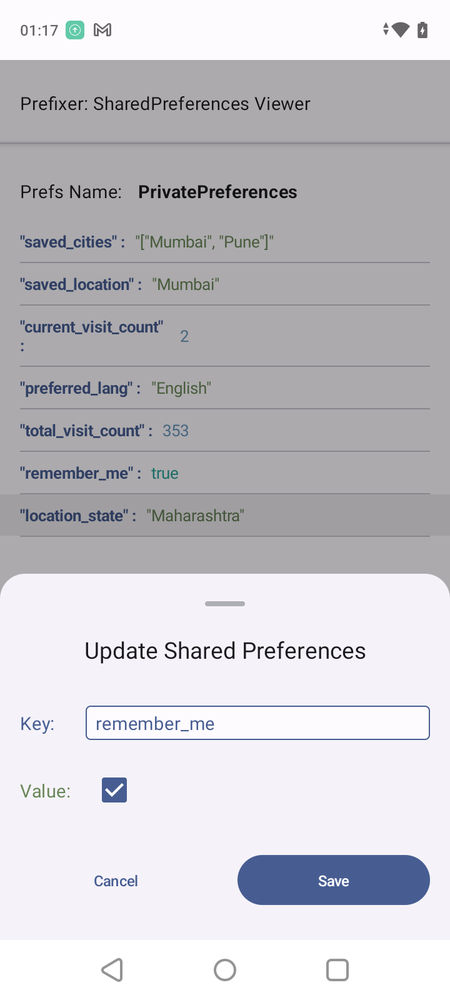

# Prefixer

Prefixer is an intuitive Android library designed for developers to effortlessly visualize and modify SharedPreferences. It simplifies preference management and enhances debugging and development efficiency by providing accessible SharedPreferences manipulation directly from your app's UI.


## Snapshots

|          All Preferences Activity           |      Edit String/Number Preferences      |       Edit Boolean Preferences       |
|:-------------------------------------------:|:----------------------------------------:|:------------------------------------:|
|  |  |  |


## Features

- **Easy Initialization**: Quick setup with just one line of code.
- **User-Friendly UI**: Launches a new activity displaying all SharedPreferences in a clean and interactive interface.
- **Edit Preferences**: Allows editing of SharedPreferences values directly from the UI with a simple ***long-press***.
- **Seamless Integration**: Easily integrates into existing Android projects without hassle.

## Getting Started

### Installation

To add Prefixer to your project, follow these steps:

1. Ensure you have `mavenCentral()` in your project's `build.gradle` file:

    ```gradle
    allprojects {
        repositories {
            ...
            mavenCentral()
        }
    }
    ```
2. Add Prefixer dependency to your module's build.gradle file:

    ```gradle
    dependencies {
       implementation 'dev.vishalgaur:prefixer:1.0.3'
    }
    ```

### Quick Start

To utilize Prefixer in your application, adhere to these steps:

1. Initialize Prefixer in your Activity class:
   ```kotlin
   class MyActivity : ComponentActivity() {
      override fun onCreate() {
         super.onCreate()
         val instance = Prefixer.initialize(this, "pref_file_name") // Replace "pref_file_name" with your actual preferences file name.
      }
   }
   
   ```

2. Retrieve the launch intent for viewing and editing the SharedPreferences, then start the activity:
   ```kotlin
   val launchIntent = instance.getLaunchIntent(this)
   startActivity(launchIntent)
   ```
   
